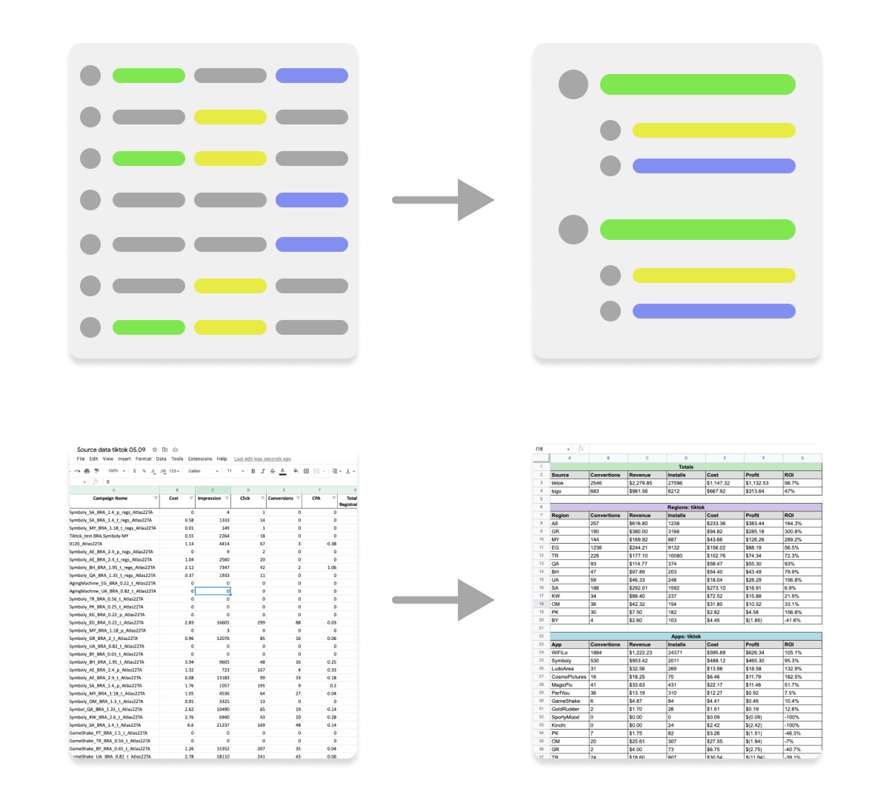

# Atlas Traffic Report
Google Sheets js automated traffic report for performance marketing agency 
Groups running advertising campaigns data by sources, apps, regions 
Sums 

# Concept
 

# Usage 

<b>Campaign name tamplate:</b>
AppName_Region_Agent_CustomField_AdAccount

<b>Cases:</b>
 
✅ MagicPic_AE_BRA_payout:1.4_SAMediaGroup009  
✅ MagicPic_AE_BRA_SAMediaGroup009  
❌ <b>TikTok_</b>MagicPic_AE_BRA_payout:1.4_SAMediaGroup009  
❌ MagicPic<b>.</b>AE<b>.</b>BRA<b>.</b>payout:1.4<b>.</b>SAMediaGroup009  
❌ <b>AE_MagicPic</b>_BRA_payout:1.4_SAMediaGroup009  
