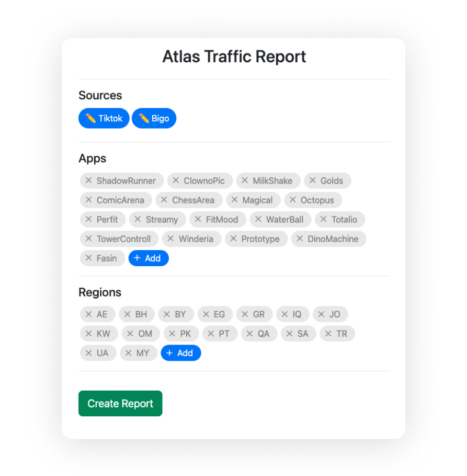
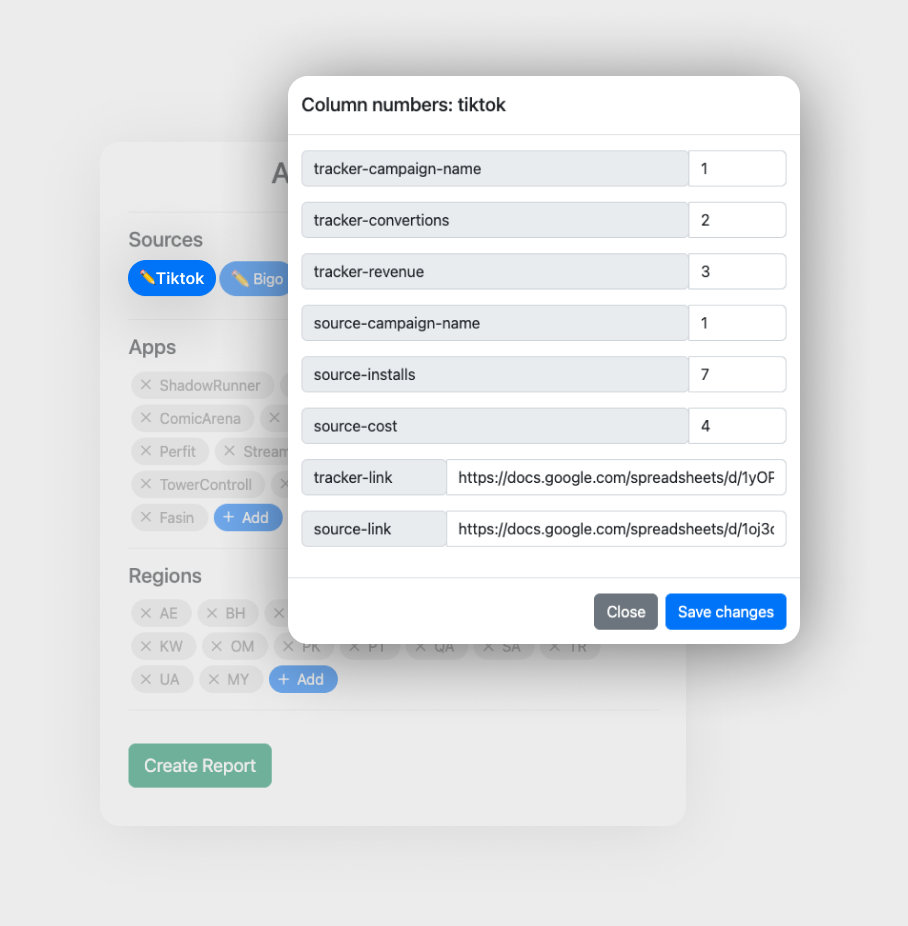
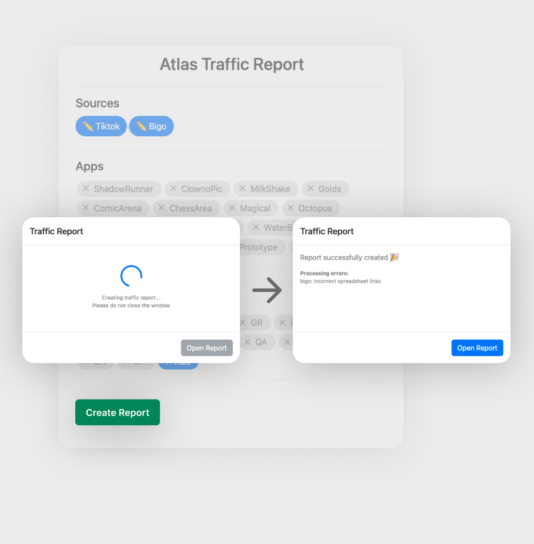

# Atlas Traffic Report
Google Apps Script traffic report for performance marketing agencies 

Connects application data and source data in the case of advertising third-party applications without direct postback 
Groups advertising campaigns data by sources, apps, regions and sums values 

# Concept
 

# Usage
 
 
Main View / Setting Source Data

 
 Create Report

# Campaign Naming
To ensure the report works correctly, all advertising campaigns must be named according to the template

<b>Campaign name tamplate:</b>
AppName_Region_Agent_CustomField_AdAccount

<b>Cases:</b>
 
✅ ShadowRunner_AE_BRA_global_SAMediaGroup009  
✅ ShadowRunner_AE_BRA_SAMediaGroup009  
❌ <strike>TikTok_</strike>ShadowRunner_AE_BRA_global_SAMediaGroup009  
❌ <strike>AE_ShadowRunner</strike>_BRA_global_SAMediaGroup009  
