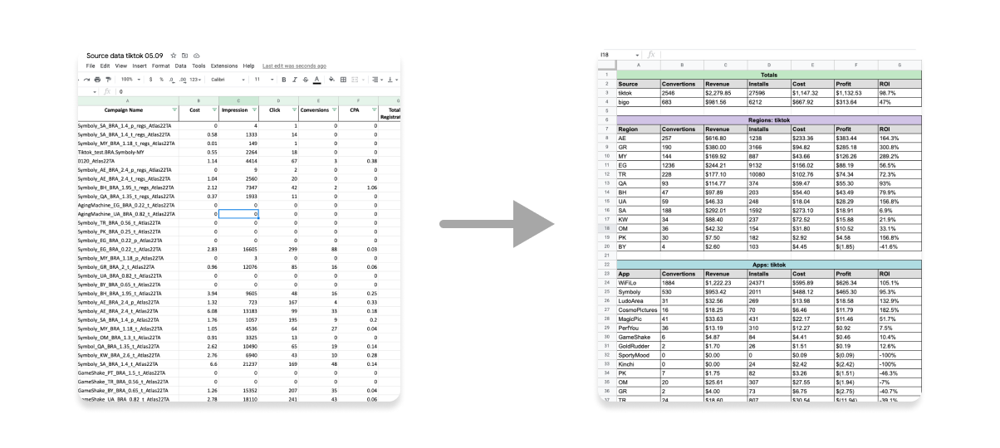

# Atlas Traffic Report
Google Sheets js automated traffic report for performance marketing agency 
Groups running advertising campaigns data by sources, apps, regions 
Sums 
# Concept
 

# Usage 

<b>Campaign name tamplate:</b>
AppName_Region_Agent_CustomField_AdAccount

<b>Cases:</b>
 
✅ MagicPic_AE_BRA_payout:1.4_SAMediaGroup009  
✅ MagicPic_AE_BRA_SAMediaGroup009  
❌ TikTok_MagicPic_AE_BRA_payout:1.4_SAMediaGroup009  
❌ MagicPic.AE.BRA.payout:1.4.SAMediaGroup009  
❌ AE_MagicPic_BRA_payout:1.4_SAMediaGroup009  
