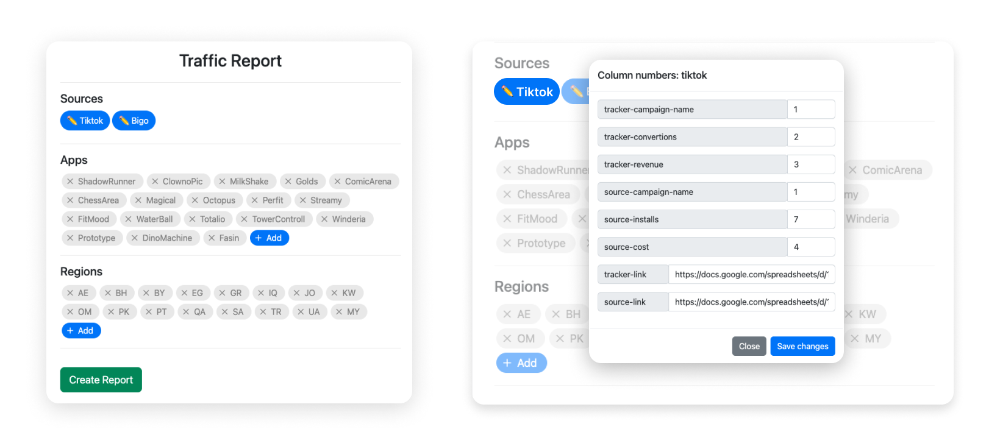

# <a href="https://script.google.com/macros/s/AKfycbxUz-JagEFB2euHp4PYwpWGKvRYvS728l9DDto3B745GcFYLc7SXTuysHMIup-ZRyn-fQ/exec">Try Demo via this link</a>
Demo takes tamplate dataset. You can make any changes, press "Demo: reset all to default" button if got stuck

# Third-Party Apps Traffic Report
 
Google Apps Script traffic report for performance marketing agencies 

Connects application data and source data in the case of advertising third-party apps without direct postback 
Groups advertising campaigns data by sources, apps, regions and sums values 

## Usage
To start using report you need:
- Campaign data from sources & apps put in separate Google Sheet with "Edit" access for everyone
- All your campaigns named correctly (explained in Campaign Naming section)

### Interface

To start using report simply link campaign data sheets by clicking on each source button in "Sources" section of the interface (✏Tiktok & ✏Bigo in given example) 
 
In pop-up menu set Google Sheets links and numbers of each column asked in menu (campaign names, convertions, revenue, installs and cost) to attach exact columns in your sheets 
 
When data sheets are linked, click on "Create Report" green button, it will open loading pop-up 
It will take 15-30 seconds to create report 
When it is complete, click "Open Report" button to open report sheet 

### Report Sections
Report is devided into 3 sections:
- General Report  
(total sum of convertions, revenue, installs & cost by each source)
- Campaign Report 
(sum of each unique segment: source, app & region)
- Error Report 
(errors related to incorrect campaign naming)

### Campaign Naming
To ensure the report works correctly, all advertising campaigns must be named according to the template

<b>Campaign name tamplate:</b>
AppName_Region_Agent_CustomField_AdAccount

<b>Cases:</b>
 
✅ ShadowRunner_AE_BRA_global_SAMediaGroup009  
✅ ShadowRunner_AE_BRA_SAMediaGroup009  
❌ <strike>TikTok_</strike>ShadowRunner_AE_BRA_global_SAMediaGroup009  
❌ <strike>AE_ShadowRunner</strike>_BRA_global_SAMediaGroup009  
